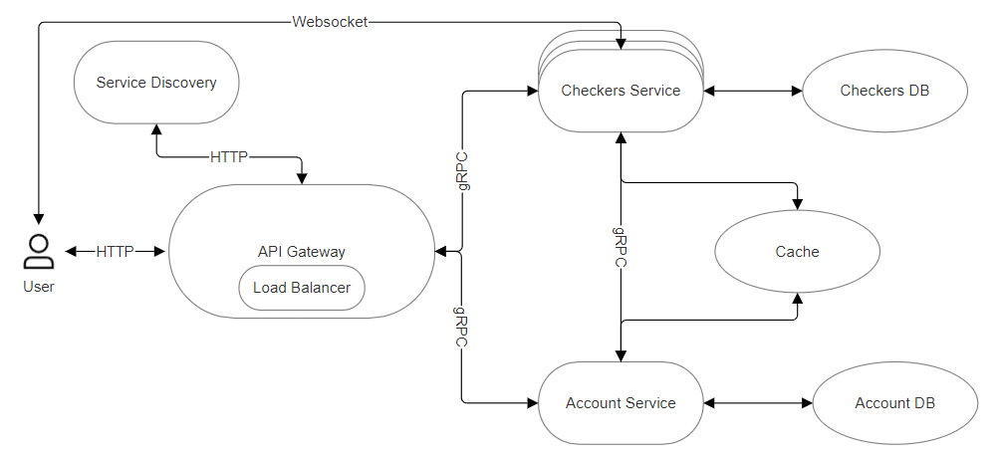

# Online Checkers Game

## Application Suitability

A list of reasons for using microservices in a simple online checkers application:

1. Scalability

    Microservices allow specific components like real-time gameplay or matchmaking to handle increased loads independently. This ensures the system can handle varying traffic without affecting other parts.

2. Independent Deployment

    You can update or modify individual features (like user authentication or game mechanics) without disrupting the entire application, offering flexibility for future improvements.

3. Technology Flexibility

    Each microservice can be developed using the best-suited technology. For example, one service could use WebSockets for real-time gameplay, while another uses a different stack for user management.

4. Fault Isolation

    If one service (like the chat or leaderboard) fails, it won’t bring down the entire application. This ensures that the core checkers gameplay remains available.

Some online gaming services, like [Checkers ONLINE](https://checkers.online/) or [lifraughts](https://lidraughts.org/) use microservices to handle different aspects of the game, such as matchmaking, game state management, and user data, ensuring smooth operation

## Service Boundaries

## Deployment and Scaling

Every component will be encapsulated in its own Docker image, which will then be used to spin up containers that can be deployed and scaled independently. Docker Compose will oversee these containers, managing their communication and ensuring they work together smoothly. Docker handles the networking, making it easy to scale and deploy containers as needed.